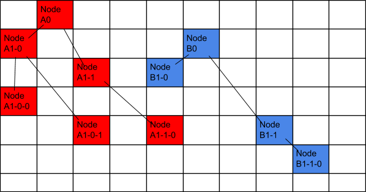
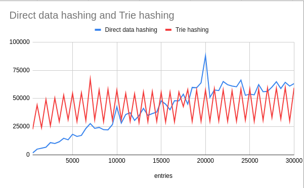

|  ZIP | Title | Status| Type | Author | Created (yyyy-mm-dd) | Updated (yyyy-mm-dd)
|--|--|--|--| -- | -- | -- |
| 8  | Adopting MPT for Contract State Hashing | Draft | Standards Track  | Liu Haichuan <haichuan@zilliqa.com>| 2020-06-05 | 2020-06-08

## Abstract

This ZIP details how **Merkle Partricia Trie** is adopted to improve the performance of contract state hashing. 

## Motivation

In the past, generating the representation of contract state is achieved by hashing the byte data of the whole state storage, which is of linear computational complexity. If there are millions of entry in a contract storage, which could be common nowadays, it would take extremely long time for this process to end. Since MPT(Merkle Partricia Trie) is a tree formed key-value storage data structure, whose lookup, insert, and delete opration are of O(logN) computation complexity. Besides, it can also provide the representation of the data stored by its top root hash. it will be a great match if we can integrate it for our scenario.

## Specification

### Merkle Partricia Tree
Please refer to [*Modified Merkle Patricia Trie — How Ethereum saves a state*](https://medium.com/codechain/modified-merkle-patricia-trie-how-ethereum-saves-a-state-e6d7555078dd) for more details of Merkle Partricia Trie.

To be simplified, here are some related points to grab:
1. MPT is key-value storage data structure with complete certainty.
2. O(logN) complexity for inserting, searching and deleting.
3. The address of each tree node is the hash of its value part, which can be used for locating the node in the tree, and serves as the key in database.

### Trie
Here we will explain how MPT is architected within our system, it includes these parts:
- [*TrieDB.h*](https://github.com/Zilliqa/Zilliqa/blob/master/src/depends/libTrie/TrieDB.h): the core logic part for realizing Merkle Partricia Tree
- [*MemoryDB.h*](https://github.com/Zilliqa/Zilliqa/blob/master/src/depends/libDatabase/MemoryDB.h): provides in-memory container for storing the tree nodes
- [*OverlayDB.h*](https://github.com/Zilliqa/Zilliqa/blob/master/src/depends/libDatabase/OverlayDB.h): An inherented class of MemoryDB, interfacing with database for commiting the in-memory data to permanent storage and accessing it.


however, this is not sufficient since for contract storage the following features have to be met:
- Delta formation
- Atomic commitment
- Revertibility

### MPT for Contract State Storage
The following diagram shows how MTP is structured and utilized for contract state storage.


* **TempTrie**: corresponds to AccountStoreTemp, generating storage root hash of contract account after applying contract transaction
* **PermTrie**: corresponds to AccountStore, generating storage root hash for finalized contract states (after committing delta during final block consensus).
* **OverlayMap**: a variadic template class which provides the four essential operations (exists, lookup, insert, kill) required by Trie, with arbitrary numbers of embedded container layers to traverse recursively. The followings are the basic logics of handling those operations:
  - exists: if found the key in head layer, return true. Otherwise check the next layer. If reached the last layer and still not found, return false.
  - lookup: if found the key in head layer, return its value. Otherwise check the next layer. If reached the last layer and still not found, return empty string.
  - insert: insert key-value pair to the head layer.
  - kill: kill key-value pair from head layer by key.
* **AddDeleteMap**:
  - m_adds: newly added or updated key-value pair of contract state.
  - m_deletes: keys to be deleted from database later. Before the commitment happens, it will be used as a filter to exclude values found from m_adds in the lower layers.

### Demonstration on why can all the contracts share one database table for storage.



- It shows how two state tries co-exists in one single database table, each node has a hash string as key.
- All the Red blocks represent the nodes of the state trie for contract A, if we want to fetch the value stored in NodeA-1-0, firstly we will initialize the trie with the root node NodeA0 by its key as rootHash, then extract the value in NodeA-1-0 by searching algorithm defined in MPT. Similar for all the other operations such as insert, remove etc..

## Implementation

This ZIP is implemented in the following pull requests in the Zilliqa core repository:
- [PR2088](https://github.com/Zilliqa/Zilliqa/pull/2088)

## Benchmark



The above is the benchmark result of comparing direct data hashing against trie storage. Each entry represents a new field in a map data type for contract Simple-Map (seen in Appendix:A). The time is measured in microsecond.
To simulate the real scenario, with every 100 new fields added by processing transactions, we dump them from temporary state map into the permanent state map; and with every 1000 new fields added, we dump all the in memory state into disk, and clean the memory at meantime.

From observation, for direct data hashing, we can find a linear increment of time spent against to the number of entries in the map. While for trie hashing, the trend almost complies to the expectation of O(logN).

However, when the amount of entry is small, direct hashing takes much less time. So if there is no map data type in the contract, we can still adopt the previous solution.

## Backward Compatibility

The way of generating the storage hash will be different, and a data migration is needed to apply the change to all the affected existing contracts, thus this feature is not backward compatible and cannot be applied to the blockchain before the point of implementation.

## Appendix

### A.Simple-Map Contract
```
scilla_version 0
library SimpleMap
let one = Int32 1
let inc =
  fun (a : Int32) =>
    builtin add a one
contract SimpleMap()
field access_count : Map ByStr20 Int32 = Emp ByStr20 Int32
transition Increment ()
  cur <- access_count[_sender];
  match cur with
  | Some i =>
    j = inc i;
    access_count[_sender] := j
  | None =>
    access_count[_sender] := one
  end
end
procedure IncrementN (n : Int32)
  cur <- access_count[_sender];
  match cur with
  | Some i =>
    j = builtin add i n;
    access_count[_sender] := j
  | None =>
    access_count[_sender] := one
  end
end
transition IncrementNOpt (nopt: Option Int32)
  match nopt with
  | Some n =>
    IncrementN n
  | None =>
  end
end
```

## Copyright Waiver

Copyright and related rights waived via [CC0](https://creativecommons.org/publicdomain/zero/1.0/).